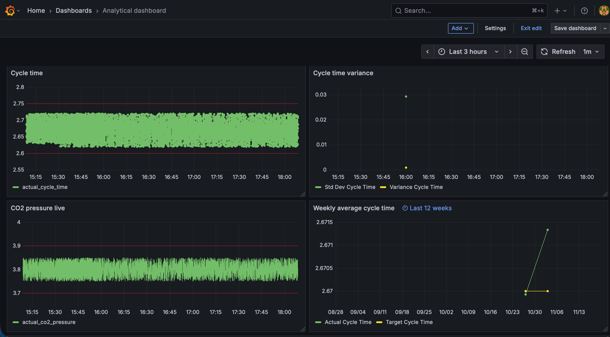
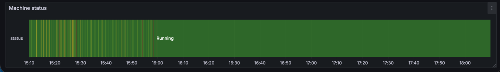

# Project Documentation

---

## OPC-UA Server
### This program simulates a beverage filling machine 
### It has fields like this:
 - Information about the machine itself (machineName, serialNumber, plant, productionSegment, productionLine)
 - Information about the order (productionOrder, article, quantity)
 - Information about the targets of filling (targetFillVolume, targetLineSpeed, targetProductTemp, targetCO2Pressure, targetCapTorque, targetCycleTime)
 - Information about the actual state of filling (actualFillVolume, actualLineSpeed, actualProductTemp, actualCO2Pressure, actualCapTorque, actualCycleTime)
 - Machine statuses (cleaningCycleStatus, qualityCheckWeight, qualityCheckLevel, machineStatus, currentStation)
 - Quantity of bottles filled (goodBottles, badBottlesVolume, badBottlesWeight, badBottlesCap, badBottlesOther, totalBadBottles, totalBottles)
 - Statistics of order (goodBottlesOrder, badBottlesOrder, totalBottlesOrder, productionOrderProgress)
 - Miscellaneous information (currentLotNumber, expirationDate)

### Has alarms which notify:
 - Fill volume
 - Line speed
 - Production temperature
 - CO2 pressure
 - Cap torque
 - Cycle time

### Has methods like this:
 - "StartMachine" which starts the machine
 - "StopMachine" which stops the machine
 - "LoadProductionOrder" which lets you create new order
 - "EnterMaintenanceMode" which enters the machine into maintenance
 - "StartCipCycle" starts CIP cycle
 - "StartSipCycle" starts SIP cycle
 - "ResetCounters" which sets all the counters to 0
 - "ChangeProduct" changes the product in progress
 - "AdjustFillVolume" change the fill volume for bottles
 - "GenerateLotNumber" generates the lot number from current date, production order, article
 - "EmergencyStop" stops the machine in emergency mode

The machine updates variables randomly and then checks them every 2 seconds and calculates are they not crossing the thresholds.
Also, it stores the alarm history for three cycles to track specific error handling.


---
## System Architecture

If you want to use [UA expert](https://www.unified-automation.com/products/development-tools/uaexpert.html) to analyse how the OPC-Server works launch docker-compose.yaml and go to this link: **opc.tcp://localhost:4334/UA/fhvopcserver**

Using [MQTT Explorer](http://mqtt-explorer.com) or other MQTT analyser reach it by **mqtt://mqtt:1883** \
MQTT broker ([eclipse-mosquito](https://hub.docker.com/_/eclipse-mosquitto)) is running on **port 1883** 

[Redis](https://hub.docker.com/r/redis/redis-stack) is running on **port 6379** and you can access the console on **localhost:8001** where you will see 
hash "FluidFillExpress2" and inside it all fields

[Redpanda](https://hub.docker.com/r/redpandadata/redpanda) has no exposed ports to the host machine but you can acces it using
[Redpanda console](https://hub.docker.com/r/redpandadata/console) on **port 8085**

[TimescaleDB](https://hub.docker.com/r/timescale/timescaledb) is running on **port 5432** 

[Grafana](https://hub.docker.com/r/grafana/grafana) is running on **port 3000**


---
## Database Schema and Continuous aggregate details
Database schema is always applied on start of new container \
You can find it in [`timescaledb/init/init.sql`](timescaledb/init/init.sql)

Or take a look below 
```sql
-- Enable timescaledb extension
CREATE EXTENSION IF NOT EXISTS timescaledb;

-- Here we are creating a statistics table where we will keep all information about the machine messages
--  Raw statistics table
--  This stores high-frequency machine telemetry:
--  - cycle times
--  - CO2 pressures
--  - machine status
--  - article & production order metadata
--
--  The PRIMARY KEY uses (time, article, production_order)
--  to ensure no duplicate rows for a timestamped reading.
CREATE TABLE IF NOT EXISTS statistics (
  time timestamptz NOT NULL,
  article TEXT NOT NULL,
  production_order TEXT NOT NULL,
  target_cycle_time DOUBLE PRECISION NOT NULL,
  actual_cycle_time DOUBLE PRECISION NOT NULL,
  target_co2_pressure DOUBLE PRECISION NULL,
  actual_co2_pressure DOUBLE PRECISION NULL,
  machine_status TEXT,
  PRIMARY KEY (time, article, production_order)
);

-- We convert it into hyper table
SELECT create_hypertable('statistics', 'time', chunk_time_interval => INTERVAL '1 day', if_not_exists => TRUE);

-- Creating indexes if for example we want to see the statistics for each article or production_order
CREATE INDEX IF NOT EXISTS idx_statistics_article ON statistics (article);
CREATE INDEX IF NOT EXISTS idx_statistics_production_order ON statistics (production_order);

-- We are keeping the statistics for 30 days
SELECT add_retention_policy('statistics', INTERVAL '30 days');

--  HOURLY KPI AGGREGATION
--  - Average cycle times
--  - Count of records per hour
--  Used for short-term operations dashboards (shift view).
CREATE MATERIALIZED VIEW IF NOT EXISTS statistics_hourly_kpis
WITH (timescaledb.continuous) AS
SELECT
    time_bucket('1 hour', time) AS bucket,   -- aggregate by hour
    article,
    production_order,
    AVG(actual_cycle_time) AS avg_actual_cycle_time,
    AVG(target_cycle_time) AS avg_target_cycle_time,
    COUNT(*) AS num_records
FROM statistics
GROUP BY bucket, article, production_order
    WITH NO DATA;

-- We set how long we want to keep them to use them in grafana
SELECT add_continuous_aggregate_policy('statistics_hourly_kpis',
   start_offset => INTERVAL '1 day',
   end_offset => INTERVAL '1 hour',
   schedule_interval => INTERVAL '30 minutes'
);


--  DAILY KPI AGGREGATION
--  - Mean, min, max cycle time
--  - Daily production order stats
--  Used for daily reports and management dashboards.
CREATE MATERIALIZED VIEW IF NOT EXISTS statistics_daily_kpis
WITH (timescaledb.continuous) AS
SELECT
    time_bucket('1 day', time) AS bucket,  -- aggregate by day
    article,
    production_order,
    AVG(actual_cycle_time) AS avg_actual_cycle_time,
    AVG(target_cycle_time) AS avg_target_cycle_time,
    COUNT(*) AS num_records,
    MIN(actual_cycle_time) AS min_actual_cycle_time,
    MAX(actual_cycle_time) AS max_actual_cycle_time
FROM statistics
GROUP BY bucket, article, production_order
WITH NO DATA;

SELECT add_continuous_aggregate_policy('statistics_daily_kpis',
   start_offset => INTERVAL '30 days',
   end_offset => INTERVAL '1 day',
   schedule_interval => INTERVAL '6 hours'
);

--  HOURLY MACHINE STATUS AGGREGATION
--  Shows machine uptime/downtime distribution.
--  Used for state timelines in Grafana.
CREATE MATERIALIZED VIEW IF NOT EXISTS statistics_hourly_status
WITH (timescaledb.continuous) AS
SELECT
    time_bucket('1 hour', time) AS bucket,
    machine_status,
    COUNT(*) AS status_count
FROM statistics
GROUP BY bucket, machine_status
WITH NO DATA;

SELECT add_continuous_aggregate_policy('statistics_hourly_status',
   start_offset => INTERVAL '1 day',
   end_offset => INTERVAL '1 hour',
   schedule_interval => INTERVAL '30 minutes'
);

--  HOURLY CO2 AGGREGATION
--  - Actual CO2
--  - Target CO2
--  - Delta
--  Used to detect pressure instability or overpressure issues.
CREATE MATERIALIZED VIEW IF NOT EXISTS statistics_hourly_co2
WITH (timescaledb.continuous) AS
SELECT
    time_bucket('1 hour', time) AS bucket,
    article,
    production_order,
    AVG(actual_co2_pressure) AS avg_actual_co2_pressure,
    AVG(target_co2_pressure) AS avg_target_co2_pressure,
    AVG(actual_co2_pressure - target_co2_pressure) AS avg_pressure_delta
FROM statistics
GROUP BY bucket, article, production_order
WITH NO DATA;

SELECT add_continuous_aggregate_policy('statistics_hourly_co2',
   start_offset => INTERVAL '1 day',
   end_offset => INTERVAL '1 hour',
   schedule_interval => INTERVAL '30 minutes'
);


--  HOURLY VARIANCE AND STANDARD DEVIATION
--  Useful to detect anomalies or early warning signs of failures.
CREATE MATERIALIZED VIEW IF NOT EXISTS statistics_hourly_variance
WITH (timescaledb.continuous) AS
SELECT
    time_bucket('1 hour', time) AS bucket,
    article,
    production_order,
    STDDEV(actual_cycle_time) AS stddev_actual_cycle_time,
    VARIANCE(actual_cycle_time) AS var_actual_cycle_time
FROM statistics
GROUP BY bucket, article, production_order
WITH NO DATA;

SELECT add_continuous_aggregate_policy(
   'statistics_hourly_variance',
   start_offset => INTERVAL '1 day',
   end_offset => INTERVAL '1 hour',
   schedule_interval => INTERVAL '30 minutes'
);


--  HOURLY THROUGHPUT AGGREGATION
--  - Counts total cycles per hour
--  Ideal for OEE dashboards, shift reports, and trend charts.
CREATE MATERIALIZED VIEW IF NOT EXISTS statistics_hourly_throughput
WITH (timescaledb.continuous) AS
SELECT
    time_bucket('1 hour', time) AS bucket,
    article,
    production_order,
    COUNT(*) AS total_cycles
FROM statistics
GROUP BY bucket, article, production_order
WITH NO DATA;


SELECT add_continuous_aggregate_policy(
   'statistics_hourly_throughput',
   start_offset => INTERVAL '1 day',
   end_offset => INTERVAL '1 hour',
   schedule_interval => INTERVAL '30 minutes'
);

--  WEEKLY KPI AGGREGATION (LONG-TERM)
--  Used for reporting trends over multiple months.
--  Contains:
--   - weekly averages
--   - weekly min/max
--   - total number of readings
CREATE MATERIALIZED VIEW IF NOT EXISTS statistics_weekly_kpis
WITH (timescaledb.continuous) AS
SELECT
    time_bucket('7 days', time) AS bucket,
    article,
    production_order,
    AVG(actual_cycle_time) AS avg_actual_cycle_time,
    AVG(target_cycle_time) AS avg_target_cycle_time,
    MIN(actual_cycle_time) AS min_actual_cycle_time,
    MAX(actual_cycle_time) AS max_actual_cycle_time,
    COUNT(*) AS records
FROM statistics
GROUP BY bucket, article, production_order
WITH NO DATA;

SELECT add_continuous_aggregate_policy(
   'statistics_weekly_kpis',
   start_offset => INTERVAL '120 days',
   end_offset => INTERVAL '7 days',
   schedule_interval => INTERVAL '12 hours'
);

--  MONTHLY CO2 AGGREGATION (LONG-TERM)
--  Useful for environmental/energy reporting & compliance.
CREATE MATERIALIZED VIEW IF NOT EXISTS statistics_monthly_co2
WITH (timescaledb.continuous) AS
SELECT
    time_bucket('1 month', time) AS bucket,
    article,
    production_order,
    AVG(actual_co2_pressure) AS avg_actual_co2,
    AVG(target_co2_pressure) AS avg_target_co2,
    AVG(actual_co2_pressure - target_co2_pressure) AS avg_delta
FROM statistics
GROUP BY bucket, article, production_order
    WITH NO DATA;

SELECT add_continuous_aggregate_policy(
   'statistics_monthly_co2',
   start_offset => INTERVAL '1 year',
   end_offset => INTERVAL '1 month',
   schedule_interval => INTERVAL '1 day'
);
```

---
## Grafana configuration

You can find the Grafana dashboard in [```grafana-dashboard.json```](grafana-dashboard.json) \
In the Grafana dashboard I made visualisations that I think are necessary to beverage filling
machine. \
Added Stat visualisations which show monthly CO2, average hourly CO2 delta difference which uses continuous
data aggregation. Also, stat visualisation which shows current machine status.

Total cycles bar chart which uses hourly throughput continuous aggregator.

Time series charts which represent hourly average cycle time, cycle time variance, weekly average 
cycle time they use the appropriate continuous aggregators.

Also, there are real time raw time series charts which show live cycle time and CO2 pressure.

At the bottom there is state timeline chart which shows the machine status during over a period of time.






